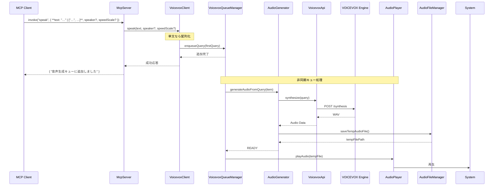
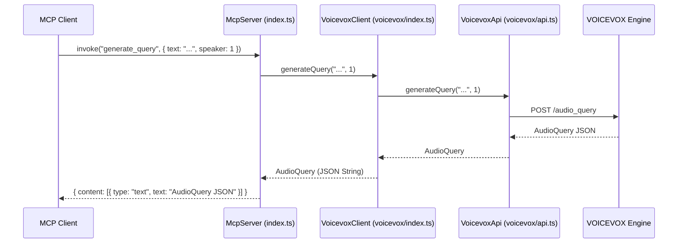
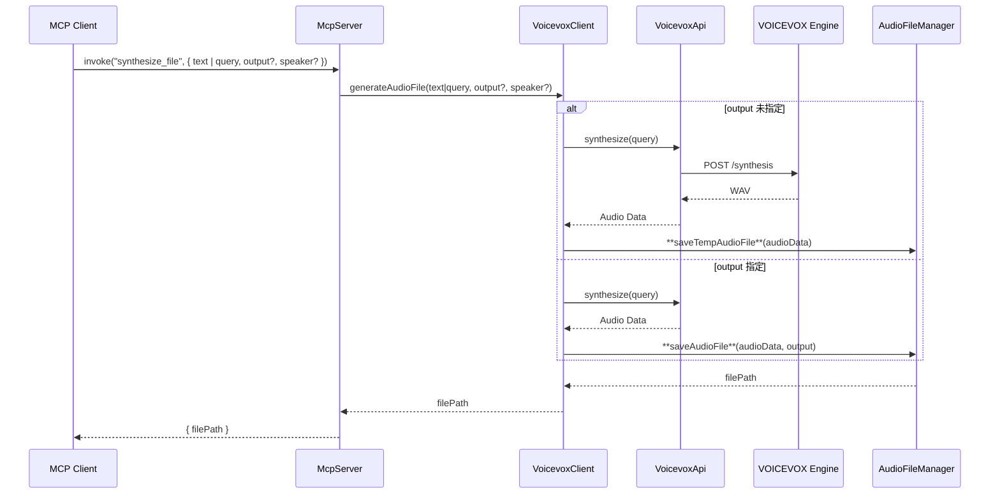
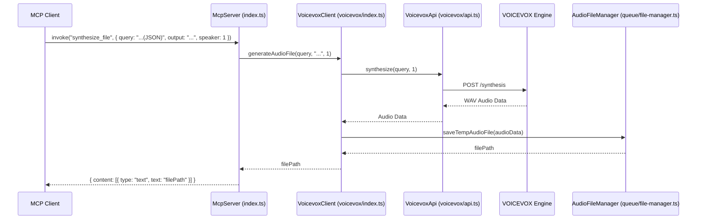
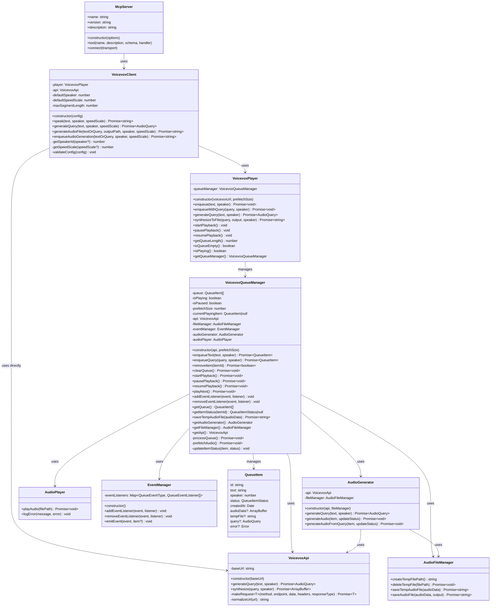

# MCP TTS Voicevox の図解

このドキュメントでは、MCP TTS Voicevox の動作シーケンスとクラス構造を図で示します。

## ツール仕様サマリ

| ツール名 | 主パラメータ | 型 | 備考 |
|----------|--------------|----|------|
| `speak` | `text` | string[] | 配列 |
|  | `speaker?` `speedScale?` | number | 省略時はデフォルト |
| `generate_query` | `text` | string | |
| `synthesize_file` | `text?`／`query?` | string / AudioQuery | `query` 優先 |
|  | `output` | string | 未指定なら一時ファイル|
| `clear_queue` | – | – | |

## シーケンス図

### `speak` 呼び出し

### `generate_query` 呼び出し

### `synthesize_file` 呼び出し (テキスト指定)

### `synthesize_file` 呼び出し (クエリ指定)

## クラス図

主要なクラスとその関連を示します。

