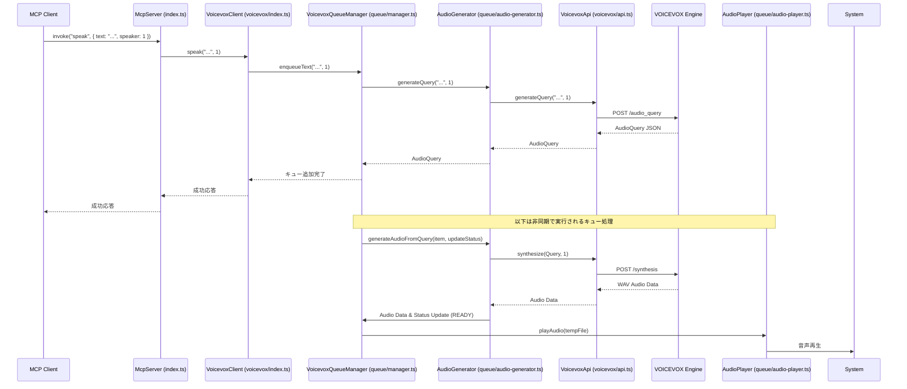
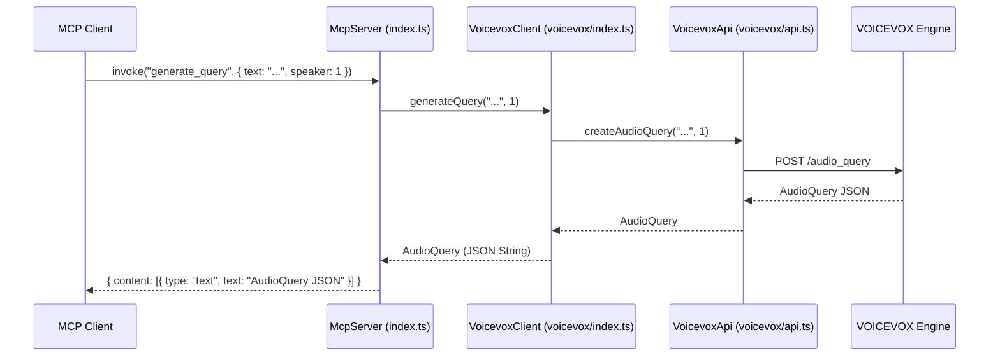
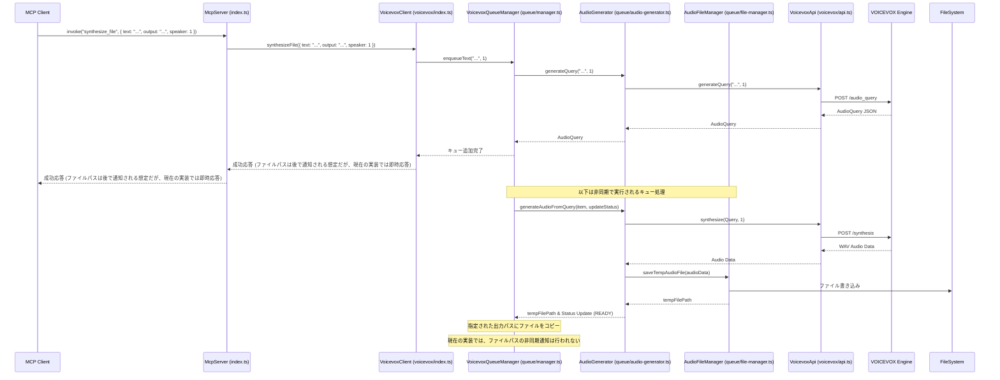

# 図解

このドキュメントでは、MCP TTS Voicevox の動作シーケンスとクラス構造を図で示します。

## シーケンス図

### `speak` ツールの呼び出し

MCPクライアントが `speak` ツールを呼び出した際の、テキストの音声再生までの大まかな流れを示します。



### `generate_query` ツールの呼び出し

MCPクライアントが `generate_query` ツールを呼び出した際の、AudioQuery生成の流れを示します。



### `synthesize_file` ツールの呼び出し (テキスト指定)

MCPクライアントが `synthesize_file` ツールをテキスト指定で呼び出した際の、音声ファイル生成の流れを示します。



## クラス図

主要なクラスとその関連を示します。

```mermaid
classDiagram
    class McpServer {
        +constructor()
        +start()
        +registerTool(name, tool)
        #handleRequest(request)
        #sendResponse(response)
    }

    class VoicevoxClient {
        -api: VoicevoxApi
        -queueManager: VoicevoxQueueManager
        -defaultSpeaker: number
        +constructor(options)
        +speak(text, speaker) Promise<void>
        +generateQuery(text, speaker) Promise<string>
        +synthesizeFile(options) Promise<string>
        +getSpeakers() Promise<any[]>
    }

    class VoicevoxApi {
        -baseUrl: string
        -axiosInstance: AxiosInstance
        +constructor(baseUrl)
        +generateQuery(text, speaker) Promise<AudioQuery>
        +synthesize(query, speaker) Promise<ArrayBuffer>
        +getSpeakers() Promise<any[]>
        #handleError(error)
    }

    class VoicevoxQueueManager {
        -queue: QueueItem[]
        -isPlaying: boolean
        -isPaused: boolean
        -prefetchSize: number
        -currentPlayingItem: QueueItem|null
        -api: VoicevoxApi
        -fileManager: AudioFileManager
        -eventManager: EventManager
        -audioGenerator: AudioGenerator
        -audioPlayer: AudioPlayer
        +constructor(api, prefetchSize)
        +enqueueText(text, speaker) Promise<QueueItem>
        +enqueueQuery(query, speaker) Promise<QueueItem>
        +removeItem(itemId) Promise<boolean>
        +clearQueue() Promise<void>
        +startPlayback() Promise<void>
        +pausePlayback() Promise<void>
        +resumePlayback() Promise<void>
        +playNext() Promise<void>
        +addEventListener(event, listener) void
        +removeEventListener(event, listener) void
        +getQueue() QueueItem[]
        +getItemStatus(itemId) QueueItemStatus|null
        +saveTempAudioFile(audioData) Promise<string>
        -processQueue() Promise<void>
        -prefetchAudio() Promise<void>
        -updateItemStatus(item, status) void
        -playAudio(filePath) Promise<void>
    }

    class AudioGenerator {
        -api: VoicevoxApi
        -fileManager: AudioFileManager
        +constructor(api, fileManager)
        +generateQuery(text, speaker) Promise<AudioQuery>
        +generateAudio(item, updateStatus) Promise<void>
        +generateAudioFromQuery(item, updateStatus) Promise<void>
    }

    class AudioFileManager {
        +createTempFilePath() string
        +deleteTempFile(filePath) Promise<void>
        +saveTempAudioFile(audioData) Promise<string>
    }

    class AudioPlayer {
        +playAudio(filePath) Promise<void>
        +logError(message, error) void
    }

    class EventManager {
        -eventListeners: Map<QueueEventType, QueueEventListener[]>
        +constructor()
        +addEventListener(event, listener) void
        +removeEventListener(event, listener) void
        +emitEvent(event, item?) void
    }

    class QueueItem {
        id: string
        text: string
        speaker: number
        status: QueueItemStatus
        createdAt: Date
        audioData?: ArrayBuffer
        tempFile?: string
        query?: AudioQuery
        error?: Error
    }

    McpServer --> VoicevoxClient : uses
    VoicevoxClient --> VoicevoxApi : uses
    VoicevoxClient --> VoicevoxQueueManager : uses
    VoicevoxQueueManager --> VoicevoxApi : uses
    VoicevoxQueueManager --> AudioFileManager : uses
    VoicevoxQueueManager --> EventManager : uses
    VoicevoxQueueManager --> AudioGenerator : uses
    VoicevoxQueueManager --> AudioPlayer : uses
    VoicevoxQueueManager --> QueueItem : manages
    AudioGenerator --> VoicevoxApi : uses
    AudioGenerator --> AudioFileManager : uses