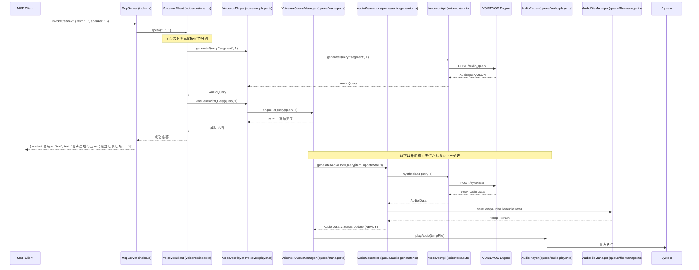
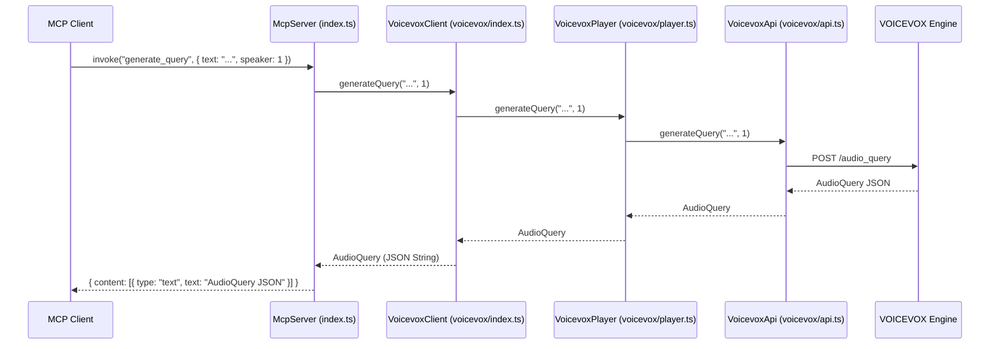
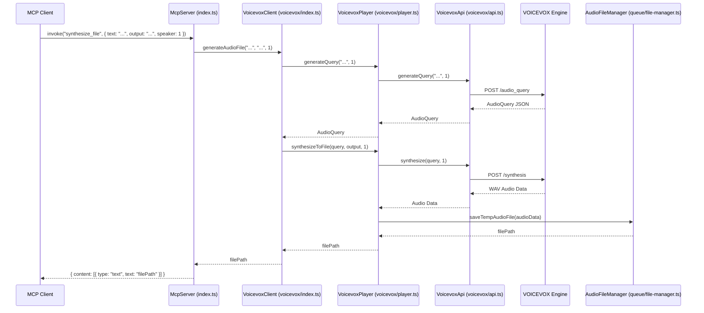
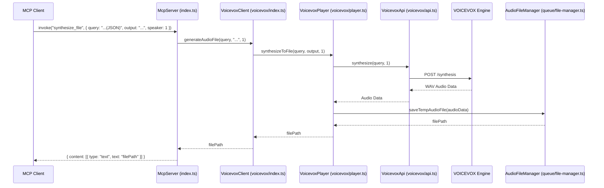
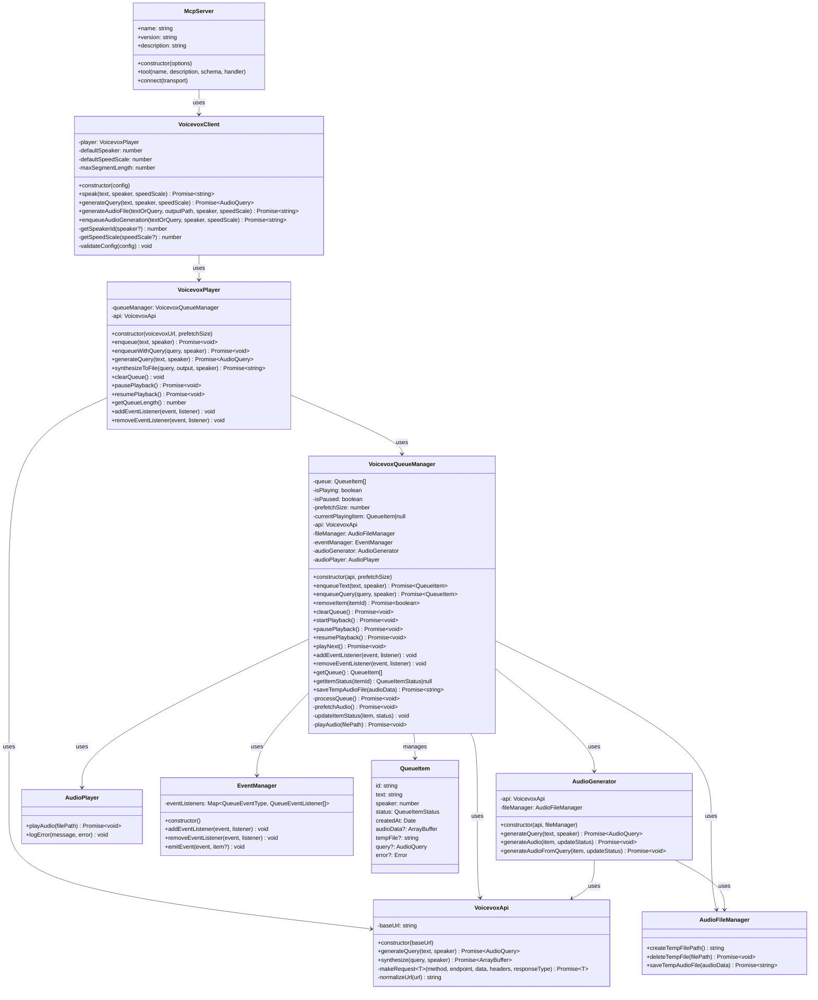
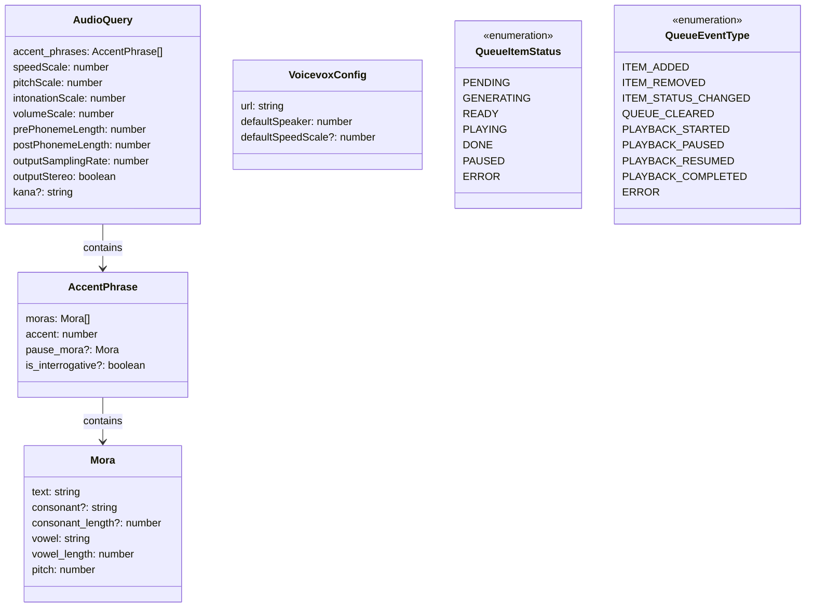

# MCP TTS Voicevox の図解

このドキュメントでは、MCP TTS Voicevox の動作シーケンスとクラス構造を図で示します。

## シーケンス図

### `speak` ツールの呼び出し

MCPクライアントが `speak` ツールを呼び出した際の、テキストの音声再生までの大まかな流れを示します。

### `generate_query` ツールの呼び出し

MCPクライアントが `generate_query` ツールを呼び出した際の、AudioQuery生成の流れを示します。

### `synthesize_file` ツールの呼び出し (テキスト指定)

MCPクライアントが `synthesize_file` ツールをテキスト指定で呼び出した際の、音声ファイル生成の流れを示します。

### `synthesize_file` ツールの呼び出し (クエリ指定)

MCPクライアントが `synthesize_file` ツールをクエリ指定で呼び出した際の、音声ファイル生成の流れを示します。

## クラス図

主要なクラスとその関連を示します。

## データ型

主要なデータ型を示します。

